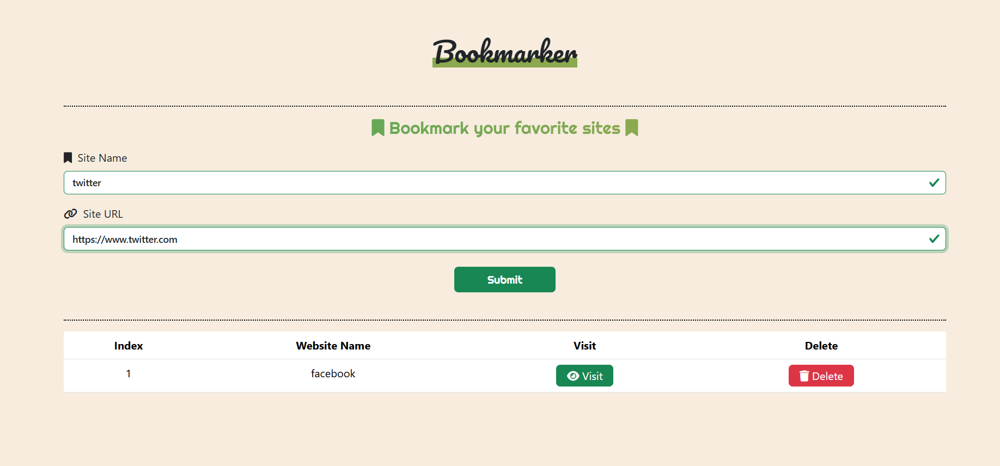
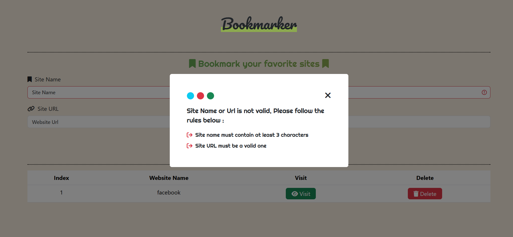

# Bookmarker

A simple and intuitive web application designed to help you organize and access your favorite websites with ease. Bookmark your frequently visited sites, keep them neatly listed, and visit them instantly or delete them when no longer needed.

---

##### 🌐 visit the website: [BookMarker Live Demo](https://anas26772001.github.io/Bookmarker/)

### 🚀 preview :

🚀 *Validation*: If your input is invalid, an alert box will appear guiding you on the correct format :

## Features

* **Add Bookmarks**: Quickly add new website names and their corresponding URLs.
* **Persistent Storage**: All your bookmarks are saved locally in your browser's storage, so they persist even if you close and reopen the application.
* **Display Bookmarks**: View a clear, organized list of all your saved bookmarks in a table format.
* **Visit Sites**: Directly open any bookmarked website with a single click.
* **Delete Bookmarks**: Remove bookmarks from your list easily.
* **Input Validation**: Ensures that site names meet minimum length requirements and URLs are in a valid format before saving. An alert message guides the user on correct input.
* **Responsive Design**: Utilizes Bootstrap for a clean and responsive user interface (assuming `style.css` complements it).
---

## Technologies Used

* **HTML5**: For the basic structure and content of the web page.
* **CSS3**: Custom styling (`style.css`) along with **Bootstrap 5.3.3** for responsive design and UI components.
* **JavaScript (ES6+)**: Handles all the application logic, including DOM manipulation, event handling, data storage, and input validation.
* **Font Awesome**: Provides vector icons used throughout the application.
* **Google Fonts**: Enhances typography with a variety of stylish fonts.

---

## How to Use
To get started with Bookmarker, follow these simple steps:
1.  **Add a Bookmark**:
    * Enter the **Site Name** (e.g., "Google", "YouTube") in the "Site Name" input field.
    * Enter the **Site URL** (e.g., "https://www.google.com", "https://www.youtube.com") in the "Website Url" input field.
    * Click the **"Submit"** button.
    * *Validation*: If your input is invalid, an alert box will appear guiding you on the correct format.

2.  **Visit a Bookmark**:
    * In the table of bookmarks, click the **"Visit"** button next to the desired website.

3.  **Delete a Bookmark**:
    * In the table of bookmarks, click the **"Delete"** button next to the bookmark you wish to remove.

---
